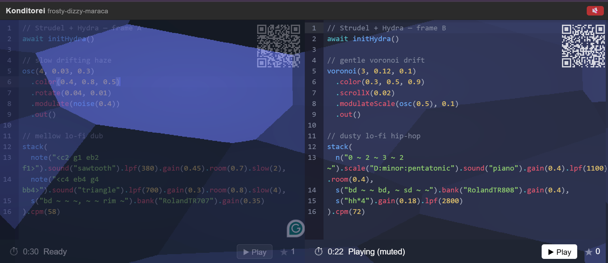

# Konditorei — a Strudel Battle Workshop

**Two editors. One stage.**



Konditorei is a head-to-head live-coding music battle for learning
[**Strudel**](https://strudel.cc) — the browser-native language for making music
with code — built on Strudel (sound) and [Hydra](https://hydra.ojack.xyz)
(visuals). Two sides, **Frame A** and **Frame B**, trade beats while a timer flips
the spotlight between them and the audience stars their favourite. It's designed
to teach Strudel by *playing*, not by lecturing — everyone in the room codes,
listens, and votes.

> New to Strudel? Start at **[strudel.cc](https://strudel.cc)** and the
> **[Strudel docs / workshop](https://strudel.cc/learn/)**.

## ▶️ Launch the workshop (no install)

[](https://codespaces.new/nu01org/Konditorei?quickstart=1)

Click the badge to open a [GitHub Codespace](https://github.com/features/codespaces).
On launch it automatically installs, builds, starts the app, and **makes the port
public** so the whole room can join:

1. Wait for the build to finish (first launch takes a minute or two).
2. Open the **Ports** panel → the **kd-web** port (`3000`) shows a public URL
   like `https://<your-codespace>-3000.app.github.dev`.
3. Share that URL (or scan the on-screen QR codes) and start battling.

> If the port isn't public yet, set port `3000` to **Public** in the Ports panel.

## How to play

- Open the app — you land on a new **match** with its own URL (e.g.
  `/funky-zippy-banjo`). Each match seeds two random, fully-commented Strudel +
  Hydra patches, one per frame.
- Hit **▶ Play** on a side to start it (and the 30-second rotation clock); the
  other side dims. The timer flips between frames so both get the spotlight.
- **🎲 Gen** loads a fresh random sample into a frame; **⬆ Update** publishes your
  edits so every device watching the match updates live.
- **★** stars the side you like — votes are shared across everyone in the match.
- Each frame's **QR code** opens that side on a phone or second laptop, so the
  audience can join, remix, and submit from their own device.

## Run it locally

```bash
cd kd-web
npm install
npm run dev        # http://localhost:5173
```

Or the production server / container:

```bash
cd kd-web
npm run build && node build          # http://localhost:3000
# or
podman build -f Containerfile -t kd-web . && podman run --rm -p 3000:3000 kd-web
```

## What's in here

| Path | What |
|------|------|
| [`kd-web/`](kd-web/) | The SvelteKit app (Strudel + Hydra, CodeMirror editors) |
| [`kd-web/src/lib/sample-patches/`](kd-web/src/lib/sample-patches/) | 20 commented Strudel sample patches |
| [`kd-web/Containerfile`](kd-web/Containerfile) | Multi-stage container build |
| [`kd-cfn/`](kd-cfn/) | CloudFormation (VPC + ALB + ECS Fargate, nested stacks) |
| [`.devcontainer/`](.devcontainer/) | Codespaces config (auto-start + public port) |
| [`scripts/`](scripts/) | Build/push image, deploy/destroy infra |
| [`docs/workshop-proposal.md`](docs/workshop-proposal.md) | Conference workshop write-up |

## Tech

SvelteKit · Svelte 5 · [Strudel](https://strudel.cc) (`@strudel/web`) ·
[Hydra](https://hydra.ojack.xyz) (`@strudel/hydra`) · CodeMirror 6 · Node adapter.
Match code and star votes are shared live across devices via Server-Sent Events,
keyed per match.

---

Made for teaching and learning Strudel. Bring your ears. 🎛️
